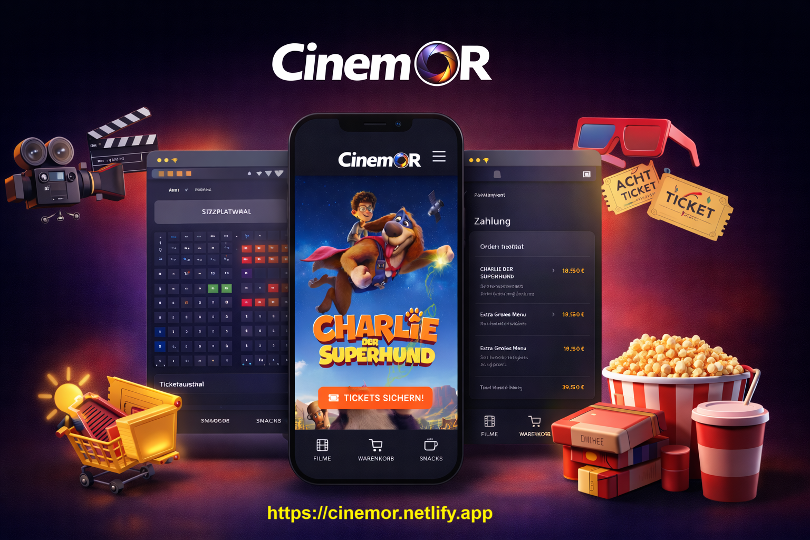

<<<<<<< HEAD
# CinemoR

Cinema ticket booking system: React frontend + Spring Boot API.

## Quick start

### 1. Backend (API)

- **Requirements:** Java 17, Maven, PostgreSQL
- Create DB: `cinemor-api`
- Configure `cinemor-api/src/main/resources/application.properties` (DB, etc.)
- Run:
  ```bash
  cd cinemor-api
  mvnw.cmd spring-boot:run
  ```
- API: `http://localhost:8081` (or the port in `server.port`)

### 2. Frontend (React)

- **Requirements:** Node.js 18+
- Install and run:
  ```bash
  cd cinemor-react
  npm install
  npm run dev
  ```
- App: `http://localhost:5173`

### Environment (frontend)

- Optional: create `.env` in `cinemor-react/`:
  - `VITE_API_URL=http://localhost:8081/api` – API base URL
  - `VITE_API_URL_WITHOUT_API=http://localhost:8081` – base without `/api`
- Defaults point to `http://localhost:8081`.

## Repo layout

- `cinemor-api/` – Spring Boot REST API (see its README)
- `cinemor-react/` – Vite + React SPA

## Production (canlıya alma)

- **Frontend:** Netlify’da deploy edildi → https://cinemor.netlify.app
- **API:** Render veya Railway’da deploy etmen ve Netlify’da `VITE_API_URL` / `VITE_API_URL_WITHOUT_API` tanımlaman gerekir.
- Adım adım rehber: **[DEPLOY.md](./DEPLOY.md)**
=======
# 🎬 CinemoR – Cinema Ticket Booking Platform

🔗 **Live Demo:** https://cinemor.netlify.app  
---
💻 **Source Code:** https://github.com/orhanDev/CinemoR

CinemoR is a modern cinema ticket booking platform that allows users to browse movies, select seats interactively and complete a full booking process through a responsive web interface.

The project demonstrates the integration of a **React frontend with a Spring Boot backend using REST APIs**.

---

## 🚀 Features

- Interactive **seat selection logic**
- Modern **responsive UI**
- Full **ticket booking workflow**
- **REST API integration** between frontend and backend
- Dynamic movie and booking interface

---

## 🛠 Tech Stack

**Frontend**

- React
- JavaScript (ES6+)
- HTML5
- CSS3

**Backend**

- Spring Boot
- REST APIs

---

## 💡 Project Purpose

This project was developed to demonstrate a **fullstack booking system architecture**, focusing on frontend interactivity and backend API integration.

Key learning aspects include:

- Building dynamic UI with React
- Implementing seat selection logic
- Connecting frontend and backend via REST APIs
- Designing a complete booking workflow

---

## 👨‍💻 Author

Orhan Yılmaz  
Full Stack Java Developer

🌐 Portfolio: https://orhancodes.com  
---
💻 GitHub: https://github.com/orhanDev  
---
🔗 LinkedIn: https://linkedin.com/in/orhan-yilmaz-codes
>>>>>>> 43e1180d913bf68d737120abfebe1423c9643f42
